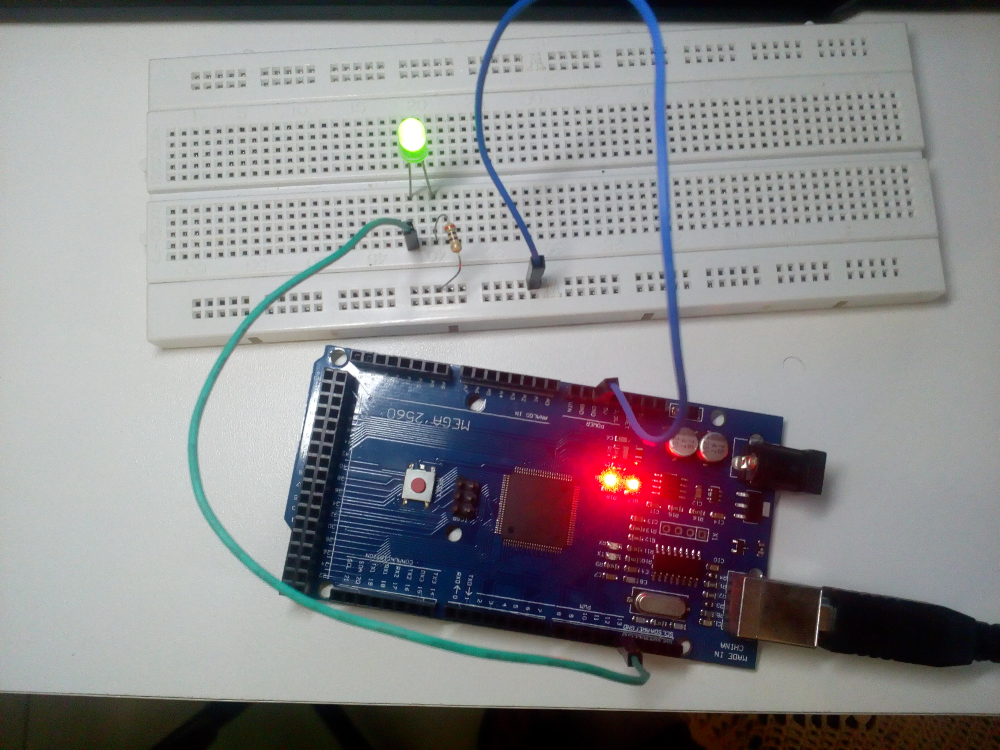
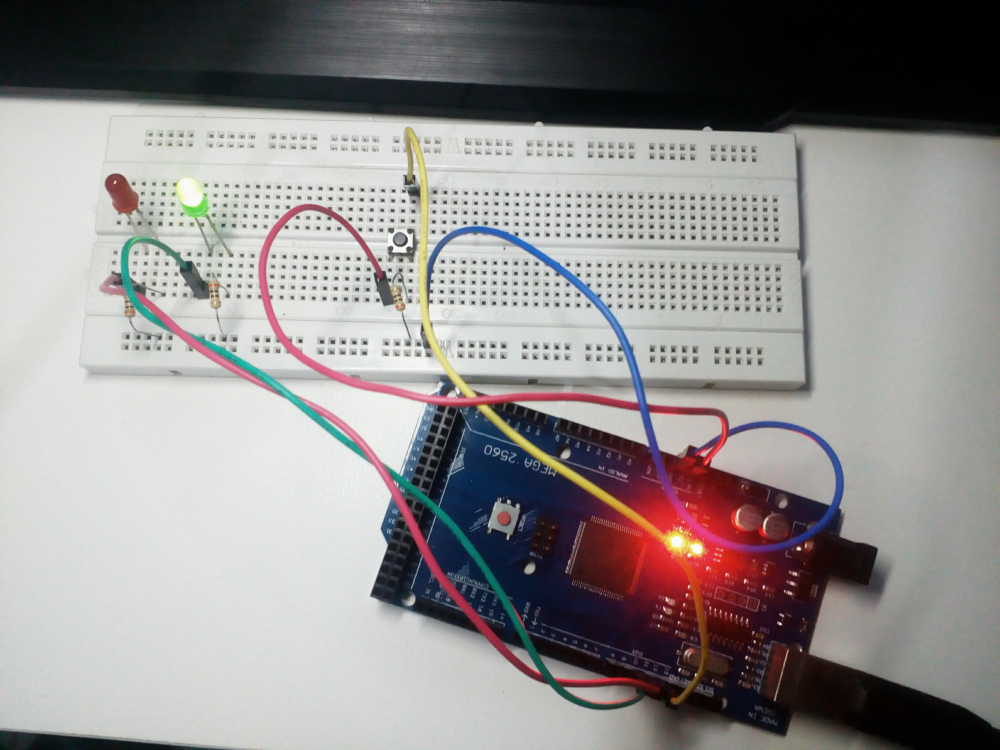

# SEMANA 1

**Microcontrolador:** 
- ATmega2560 (Arduino Mega 2560)

**Objetivos:**
- Conhecer o Arduino Mega 2560;
- Programar o Arduino;
- Desenvolver algoritmo e circuitos de entrada e saída com o Arduino.

## Experimento 1 (Saída)

O experimento 1 consistia em simplesmente dar um "Hello World!!!". O Arduino deveria ser programado no setup para ter uma saída na porta 13 que é conectada a uma LED interna da placa e no loop deveria piscar, passar 1 segundo aceso e 1 segundo apagado. 

## Experimento 2 (Entrada)

No experimento 2, a tarefa era receber o estado lógico de um circuito [PULL-DOWN](https://www.filipeflop.com/blog/entendendo-o-pull-up-e-pull-down-no-arduino/) e alternar o nível lógico de duas saídas que são conectadas a LEDs de cores diferentes.

O LED vermelho ficará aceso e o LED verde ficará apagado quando o botão estiver pressionado e o contrário quando não estiver.

Obs.: o link da imagem redireciona para um gif que mostra o funcionamento do circuito.