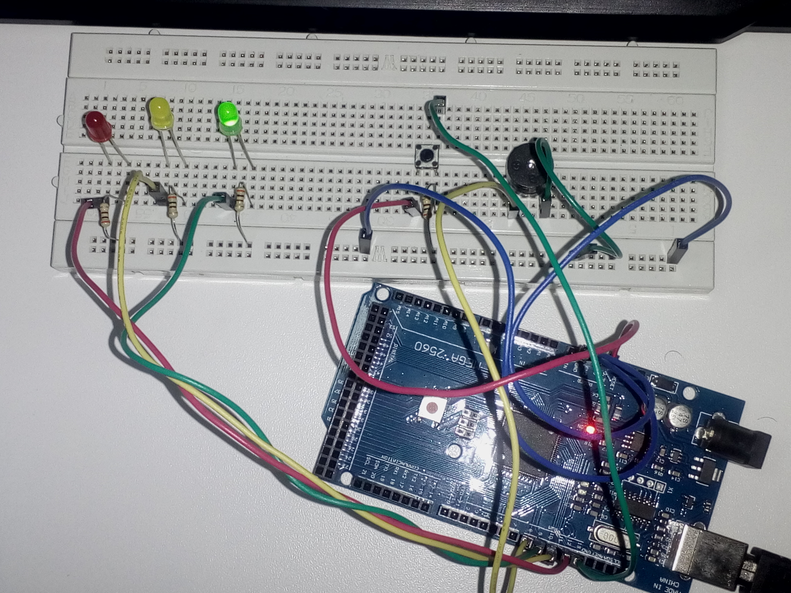

# SEMANA 2

**Microcontrolador:** 
- ATmega2560 (Arduino Mega 2560)

**Objetivos:**
- Programar o Arduino; e
- Elaborar um projeto com microcontrolador e diversos componentes.

## Experimento 1 (Semáforo)

No experimento 1, a tarefa era elaborar um semáforo simples usando LEDs vermelho, amarelo e verde. O algoritmo deveria seguir os seguintes passos no loop para acionamento:

Tempo aceso | LED
------|-----
2s | Verde (pino 9)
1s | Amarelo (pino 10)
3s | Vermelho (pino 11)

## Experimento 2 (Semáforo com botão de parada)

No experimento 2, a tarefa era implementar um semáforo com um botão de parada que, quando acionado no "sinal vermelho", depois de um ciclo no loop o Arduino apagasse o semafóro e emitisse um *bip* por meio de um buzzer por 2 segundos.

O circuito do experimento anterior é mantido. Só são adicionados um circuito [PULL-DOWN](https://www.filipeflop.com/blog/entendendo-o-pull-up-e-pull-down-no-arduino/) com um botão como entrada no pino 13 e um buzzer conectado ao pino 8, que atua como saída. O algoritmo do experimento 1 é modificado para corresponder ao que o exercício pede e atuar com os demais componentes eletrônicos.
