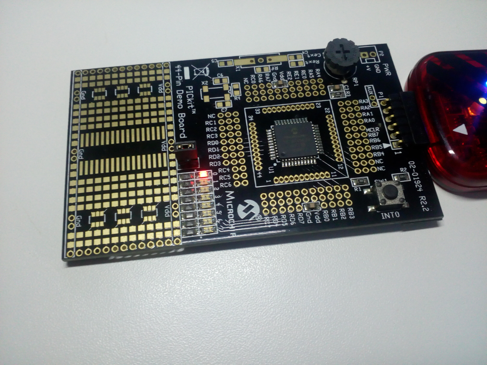
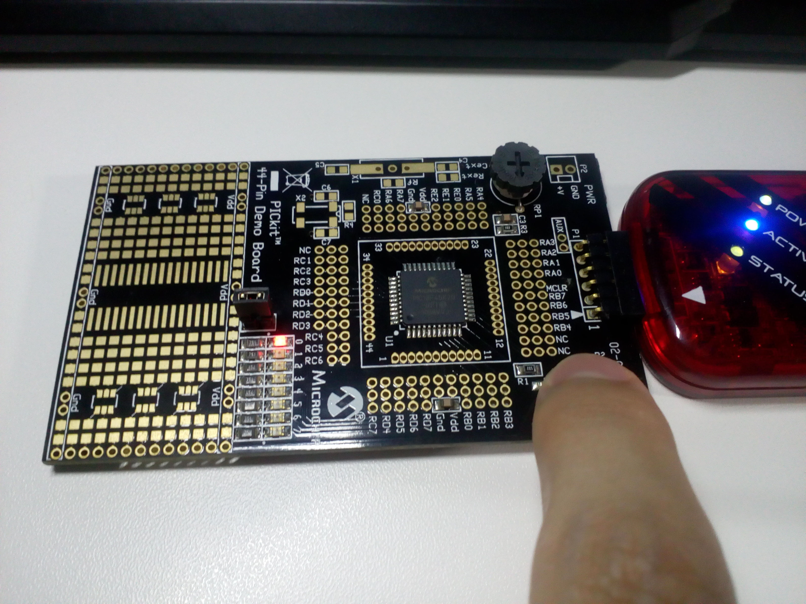
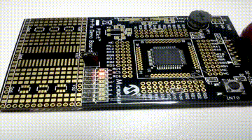

# SEMANA 3

**Microcontrolador:** 
- ATmega2560 (Arduino Mega 2560)
- PIC18F45K20

**Objetivos:**
- Conhecer o PIC18F45K20; e
- Programar o PIC.

## Experimento 1 (Saída)

Este experimento consistia em dar o "passo inicial" para criação de programas com PIC, foi dado o "Hello World!!!" acendendo um LED conectado a um dos pinos do PORTD(RD0, RD1, RD2...) desse microcontrolador, semelhante ao que foi feito no [Experimento 1 da Semana 1](./../Semana1/semana1.md).

## Experimento 2 (Entrada)

Neste experimento, o PIC foi programado para detectar o estado de um botão conectado ao pino RB0 e assim acionar um LED conectado ao PORTD, semelhante ao que foi feito no [Experimento 2 da Semana 1](./../Semana1/semana1.md).

## Experimento 3 (Semáforo)

No experimento 3, a tarefa era desenvolver um tipo de semáforo, semelhante ao que foi feito no [Semana 2](./../Semana2/semana2.md), usando os pinos da PORTD conectados a LEDs.

## Experimento 4 (Usar registradores do Arduino)

A tarefa desse experimento era basicamente utilizar registradores do microcontrolador ATmega2560 do Arduino para acionar e configurar um dos pinos.