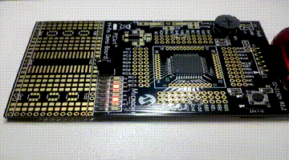
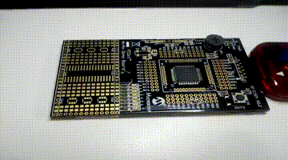
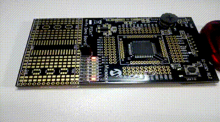

# SEMANA 4

**Microcontrolador:** 
- PIC18F45K20

**Objetivos:**
- Programar PIC; e
- Configurar entrada no pino INT0.

## Experimento 1 (Semáforo de dois tempos)

Neste experimento, o PIC foi programado para seguir a lógica de um semáforo de dois tempos, tendo os pinos RD0, RD1 e RD2 como o primeiro sinal e os pinos RD5, RD6 e RD7 como o segundo sinal. Ambos os sinais tinham LEDs conectadas para sinalização da execução. A lógica de ativação no loop segue a seguinte sequência:

Tempo aceso | Sinal 1 | Sinal 2
------------|---------|---------
3s | Verde (RD0) | Vermelho (RD7)
1s | Amarelo (RD1) | Vermelho (RD7)
3s | Vermelho (RD2) | Verde (RD5)
1s | Vermelho (RD2) | Amarelo (RD6)

## Experimento 2 (Interrupção do pino INT0)

No experimento 2, o PIC foi programado para executar uma interrupção toda vez que um botão conectado ao pino INT0(RB0) for acionado e, assim, ativar a saída no pino RD0, que é conectado a um LED.

## Experimento 3 (Semáforo de dois tempos com interrupção)

Este experimento junta as funcionalidades do experimento 1 e 2 em um só. O PIC foi programado para atuar como semáforo de dois tempos e para poder receber uma interrupção do pino INT0 quando o botão for pressionado 3 vezes. Quando isso acontecer, ambos os sinais do semáforo ficariam no "vermelho", os LEDs dos pinos RD2 e RD7 estariam ligados.