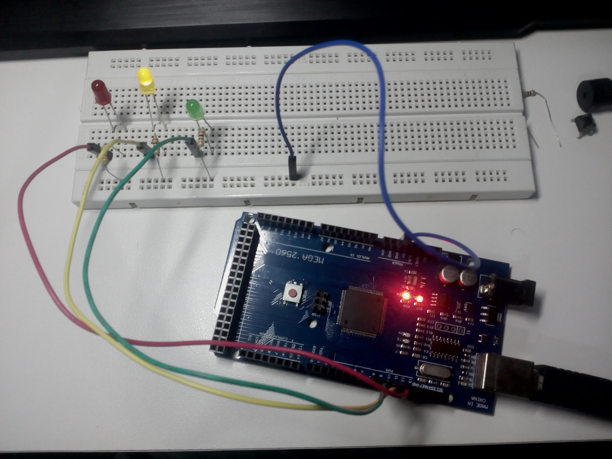

# SEMANA 5

**Microcontrolador:** 
- ATmega2560 (Arduino Mega 2560)

**Objetivos:**
- Programar o Arduino;
- Programar porta analógica do Arduino; e
- Desenvolver circuito sensor de luminosidade.

## Experimento 1 (Sensor de luminosidade)

Neste experimento, um fotoresistor foi usado em um [circuito sensor de luz](https://portal.vidadesilicio.com.br/sensor-de-luz-com-ldr/) para obter dados de luminosidade do ambiente a partir de uma porta analógica do Arduino. 

Quando lida no algoritmo, essa porta analógica retorna o valor de luminosidade entre 0 e 1023. Dependendo do valor retornado no loop de execução do código, uma sequência de portas de saida será ativada, que, no caso do circuito montado na imagem, possui LEDs para sinalização.
