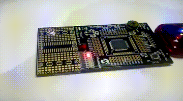

# SEMANA 6

**Microcontrolador:** 
- PIC18F45K20

**Objetivos:**
- Programar um jogo no PIC; e
- Configurar interrupção INT0.

## Experimento 1

Este experimento consistia em fazer um jogo com o PIC. Para isso:
- Todos os pinos PORTD foram configurados como **saídas** e possuem LEDs para sinalização; e
- O pino INT0(RB0), que possui circuito [PULL-UP](https://www.filipeflop.com/blog/entendendo-o-pull-up-e-pull-down-no-arduino/) com botão, é configurado como **entrada**.

A lógica do jogo é simples. Os LEDs conectados ao PORTD formariam acesos tipo uma [cobrinha](https://pt.wikipedia.org/wiki/Serpente_(jogo_eletr%C3%B4nico)), como nos jogos antigos, e iria ficar alterando de posição(trocando os LEDs que ficariam acesos) na saída. Toda vez que o jogador apertar o botão, o PIC tem que entrar em uma interrupção e verificar se naquele instante os dois LEDs do meio(dos pinos RD3 e RD4) estão acesos formando a cobrinha. Se sim, o usuário venceu e o jogo deve piscar todos os LEDs e, caso contrário, ele deve tentar novamente.