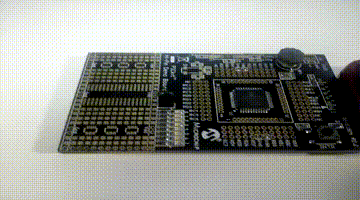

# SEMANA 7

**Microcontrolador:** 
- PIC18F45K20

**Objetivos:**
- Programar PIC; e
- Configurar interrupção INT0.

## Experimento 1

Neste experimento o PIC foi programado para que, quando se apertar o botão INT0(RB0), uma interrupção que fará os seguintes passos ser executada:
- Gerará um delay de 3 segundos e acenderá o LED 0 do PORTD;
- Gerará um delay de 2 segundos e ficará piscando o LED 2 do PORTD; e
- Irá rotacionar os LEDs 4, 5, 6 e 7 do PORTD.
